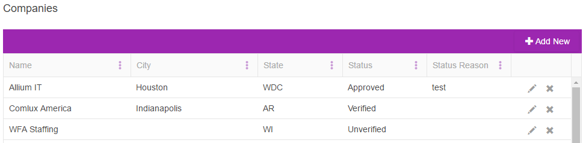
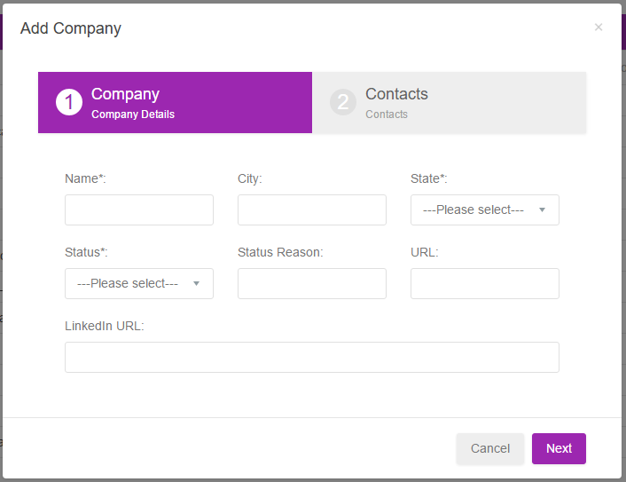
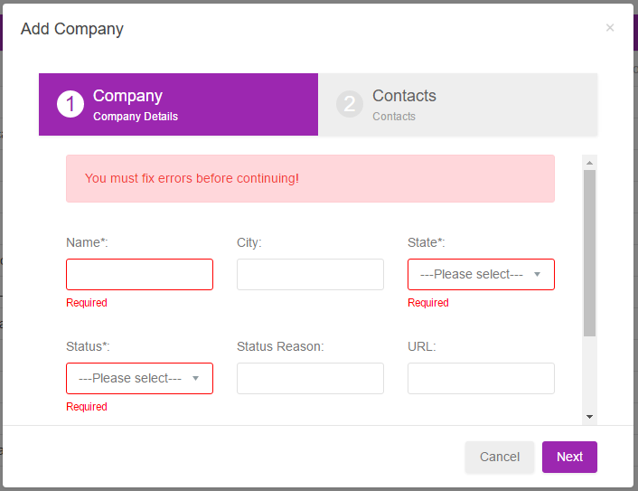
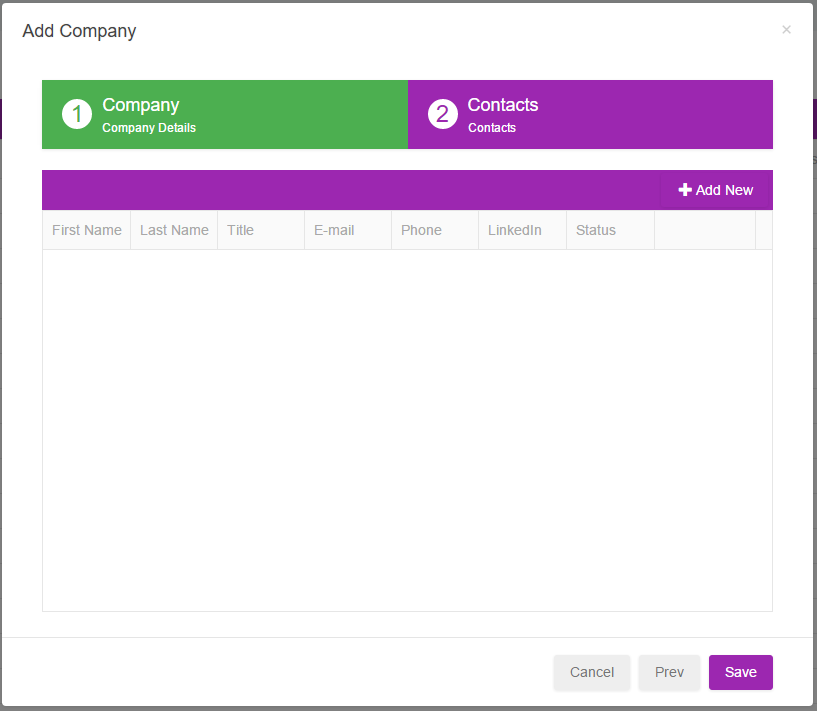

Synergy 360 CRM (Interview)
===========================

This repository consists of both the node.js backend `/server/*` and Angular.js frontend `/client/`.

## Prerequisites

* Node.js: v6.10 or higher
* Global installation of npm, bower, grunt

## Installation instructions

```bash
npm install
bower install
```

Upon successful completion of the installation, modify the database connection string in `server/config/db.js` using the provided credentials. To start the project, execute:

```bash
grunt serve
```

Open the website in Chrome and make sure there are no errors in the developer console.


## Assignment instructions
The assignment consists of two tasks.

### Task 1: Implement edit button in the kendo grid
The button should be placed right next to the delete button. On click, it should open the add/edit modal window and load the row information.
Use the icon `glyphicon glyphicon-pencil`. Use the existing function `editClick()`
Screenshot of the final result:



## Task 2: Update the interface of add-edit modal
1. Implement *Default Steps* from Remark template: [link](http://getbootstrapadmin.com/remark/mmenu/structure/step.html)
2. Use `ng-class` to switch the coloring of the step. The corresponding CSS classes are already defined: `.step`, `.step.current`,`.step.done`
3. Make sure that the validators work correctly (play with the provided code to understand the logic/implementation). Switching between the steps should not be allowed if there is an error.
4. Make sure that the window size is appropriate for each of the steps. In other words, the overall design should be visually pleasing.

Screenshots:







## Reporting
Please submit:  
(a) the archive with working code,  
(b) the estimates for the time spent on completing each task.

### Please note:
1. Your job includes testing your own code and making sure that the final product is as close to being bug-free as possible.
2. Delivering positive UX is essential to maintaining high-quality of the final product. Therefore, your modules have to strictly follow the design specs.  
   If you have questions  and/or suggestions on UI or UX, please contact the technical lead for clarification.
